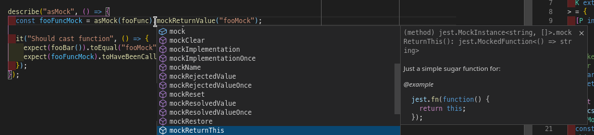
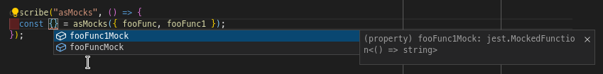
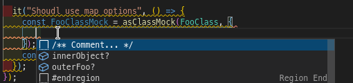

# jest-mock-inference-helper

[](https://coveralls.io/github/jurijzahn8019/jest-mock-inference-helper?branch=main)
[](LICENSE)
[](https://www.npmjs.com/package/@jurijzahn8019/jest-mock-inference-helper)
[](https://snyk.io/test/github/jurijzahn8019/jest-mock-inference-helper)
[](https://bundlephobia.com/result?p=@jurijzahn8019/jest-mock-inference-helper)
[](https://github.com/jurijzahn8019/jest-mock-inference-helper/commits/main)

This targets typescrit projects and aims to simplify declaration of mocked classes and functions

## install

```bash
npm i -D @jurijzahn8019/jest-mock-inference-helper
```

## usage

### asMock



Assuming SUT file

```typescript
import { bar, baz } from "./bar";

export function foo() {
  return bar() + " - " + baz();
}
```

in your spec file

```typescript
import { asMock } from "@jurijzahn8019/jest-mock-inference-helper";
import { foo } from "./foo";
import { bar, baz } from "./bar";

// Automock bar
jest.mock("bar");

const barMock = asMock(bar).mockReturnValue("bar");
const bazMock = asMock(baz).mockReturnValue("baz");

// same as
const barMock = (bar as jest.MockedFunction<typeof bar>).mockReturnValue("bar");
const bazMock = (baz as jest.MockedFunction<typeof baz>).mockReturnValue("baz");

describe("foo", () => {
  it("Should success", () => {
    const res = foo();

    await expect(barMock).toHaveBeenCalled();
  });
});
```

### asMocks

works similar to `asMock` but provides inference sugar for multiple
functions in a single call



Assuming SUT file

```typescript
import { bar, baz } from "./bar";

export function foo() {
  return bar() + " - " + baz();
}
```

in your spec file

```typescript
import { asMock } from "@jurijzahn8019/jest-mock-inference-helper";
import { foo } from "./foo";
import { bar, baz } from "./bar";

// Automock bar
jest.mock("bar");

const { barMock, bazMock } = asMocks({ bar, baz });

// same as
const barMock = bar as jest.MockedFunction<typeof bar>;
const bazMock = baz as jest.MockedFunction<typeof baz>;

describe("foo", () => {
  beforeEach(() => {
    barMock.mockReturnValue("bar");
    barzock.mockReturnValue("baz");
  });

  it("Should success", () => {
    const res = foo();

    await expect(barMock).toHaveBeenCalled();
  });
});
```

### asClassMock

Provides functionality to infer class mock type and also
shortcuts to implement inner object fields and/or properties

see [test file](./src/index.spec.ts#L81) for extended usage



Assuming SUT file

```typescript
import { BarClass } from "./bar";

export function foo() {
  const bar = new BarClass();

  return bar.func1() + " - " + bar.func2();
}
```

in your spec file

```typescript
import { asClassMock } from "@jurijzahn8019/jest-mock-inference-helper";
import { foo } from "./foo";
import { BarClass } from "./bar";

// Automock bar
jest.mock("bar");

const BarClassMock = asClassMock(BarClass);

// similar to
const BarClassMock = bar as jest.MockedClass<BarClassMock>;

describe("foo", () => {
  beforeEach(() => {
    BarClassMock.func1.mockReturnValue("bar");
  });

  it("Should success", () => {
    const res = foo();

    await expect(BarClassMock.func1).toHaveBeenCalled();
  });
});
```

## Changelog

[Changelog](CHANGELOG.md).

## License

[MIT Lizenz](https://choosealicense.com/licenses/mit/)
